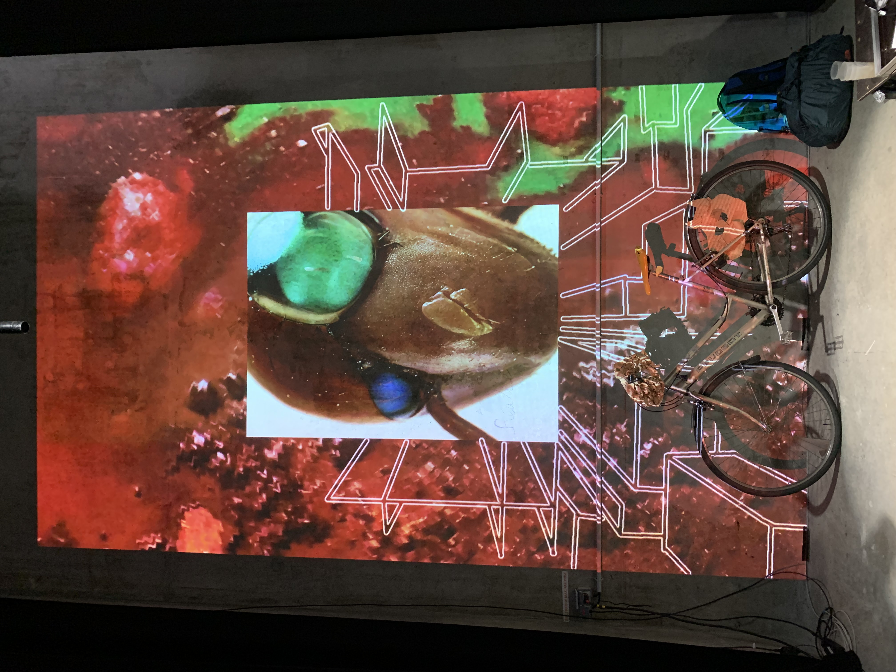

# 👹 contacts-app


## 🗒 Prérequis

**🔨 Hardware**
- Minimum une RTX 3090, 24 GB VRAM et 16 GB RAM 
- Smartphone
- Ecran 

**💽 Software**
- [Docker](https://docs.docker.com/get-docker/)
- [Nvidia Container Toolkit](https://docs.nvidia.com/datacenter/cloud-native/container-toolkit/latest/install-guide.html)
  
# 🚀 Démarrage rapide

```bash
docker-compose up
```

## 🚴 Utilisation
